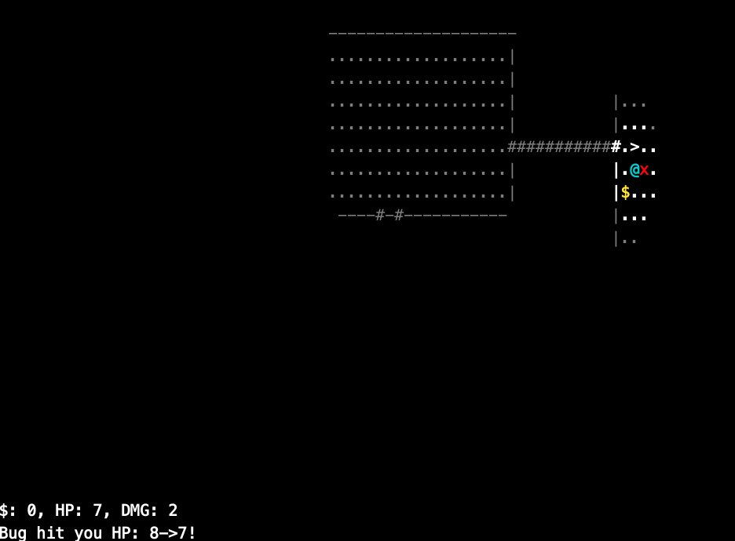
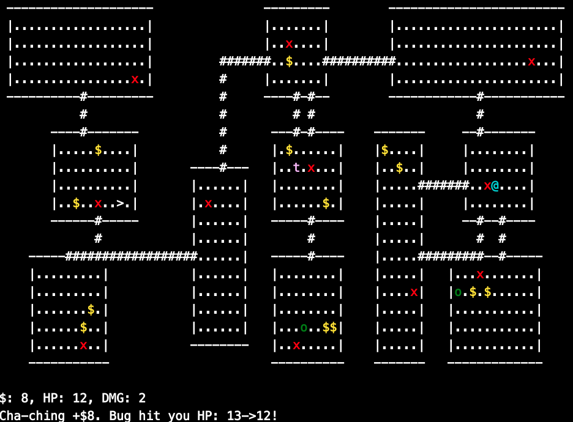

# Exanis

Exanis is an ASCII RogueLike built in C. It's inspired by the likes of nethack
and the original rogue.  
For its dungeon generation it uses a BSP (Binary space partitioning) algorithm
to first recursively divide the screen into smaller sections. Then it creates
smaller rooms inside of those sections. Finally it connects the rooms together
with corridors.  
  
Here is an in-game example:
- Rooms floors are drawn with '.'
- Rooms walls are drawn with '|' or '-'
- Corridors are drawn with '#'
- The '>' is the staircase to descend to the next dungeon
- The 'x' is a bug, that is currently attacking the player
- The '$' is some money on the ground
- The dimmed characters are parts of the map that have been explored but are currently out of the player's field of view
- The bright characters are the tiles that are in the player's field of view



Here is an in-game example to show what the map looks like without infinite field of view:



## How to play

To play you need to compile from source  
```
git clone https://github.com/pinguxx28/exanis.git
cd exanis
make
./bin/rogue
```
